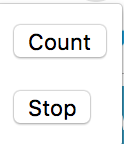
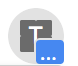
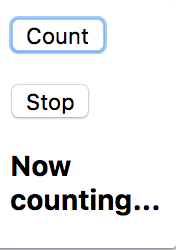
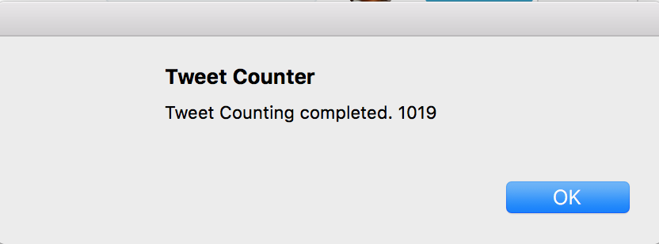
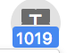
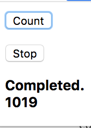
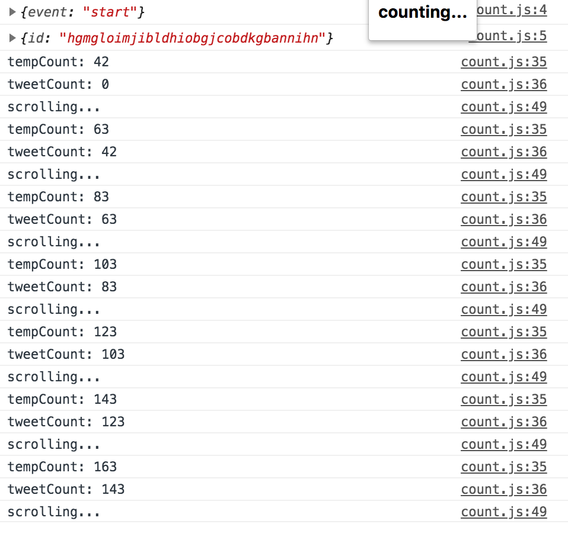

# Simple Tweet Counter as Chrome Extension

## How to use
### 1. download me as zip and unzip anywhere
### 2. Open our Chrome and go to right [...] panel > [More Tools] > [Extensions]
### 3. [Load unpacked] and select the unzipped directory in 1.
### 4. Now you can see the following icon at the right top.

### 5. Let's go to https://twitter.com
### 6. Search your tweet in the search box.

Ex1: Simple Hashtag search.
`#your_hash_tag`

Ex2: Date ranged Hashtag search.
`#your_hash_tag since:2018-10-01_00:00:00_JST until:2018-10-31_23:59:59_JST`

### 7. Once you get the reuslt, click the icon at 4. and [Count] button

### 8. Your search results began to scroll down automatically and gently and the icon change as below.

### 9. After the scroll hits the bottom, the message gets shown up and you can get the tweet count. Congrats!

## If it doesn't work...
### Reload your twitter search and click [count] again!

## How to debug
### Check your console in dev. tool which shows the progress of counting with some errors.

